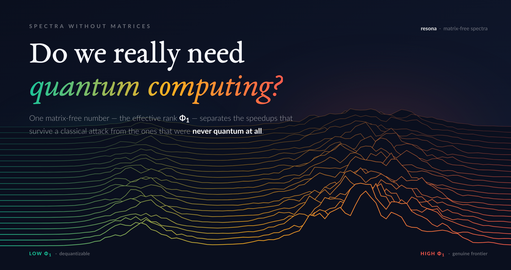

# Never Quantum at All



A self-contained essay + runnable demos. The claim — that a matrix-free *dial*
(the effective rank Φ₁) empirically flags which "quantum speedups" survive a
classical attack — is not asserted, it is **run**.

Two articles, same question, different angles:

- **The science** — [`article.md`](article.md) (also [`article.tex`](article.tex)):
  the matrix-free dial, the demos, the line between dequantizable and genuine.
- **The story** — [`the-1000-dollar-question.md`](the-1000-dollar-question.md):
  the honest companion — *"I spent ~$1000 on AI tools to find out which quantum
  advantages are real,"* less math, more confession.
- **The demos** live in [`stands/`](stands/) and are reproducible in seconds.

## Run the demos

```bash
pip install -r requirements.txt
python stands/dequantize.py      # low-rank QML collapses to classical sampling — Φ₁ ≈ 3.3
python stands/shor_wall.py       # factoring resists — Φ₁ grows, no extractable handle found
```

Both stands are built on [`resona`](https://pypi.org/project/resona/) (matrix-free
spectral computation) and print every number the article quotes, checked against
ground truth. Don't trust the essay — run the stands.

---
*Part of the "Spectra Without Matrices" series. Author: Dmitry Sierikov.*
