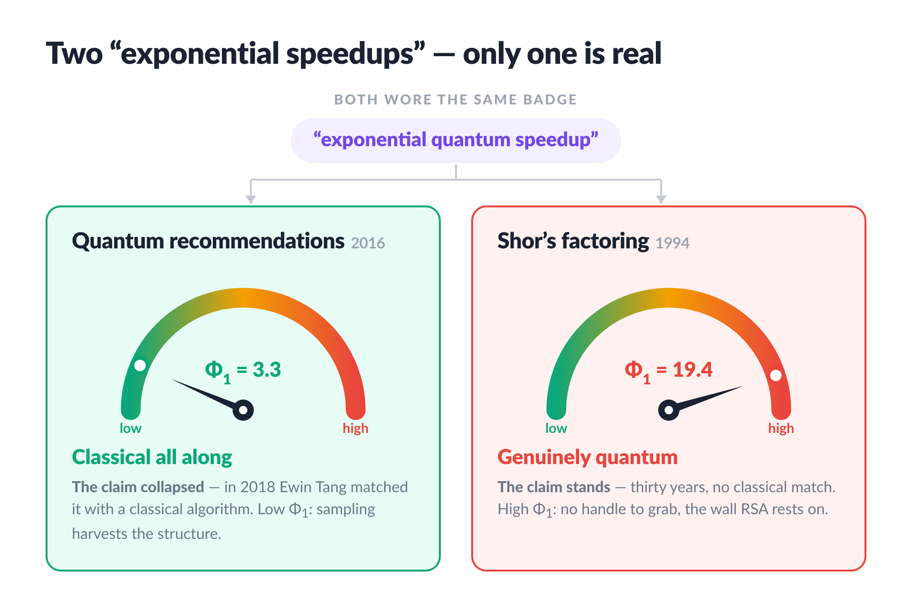
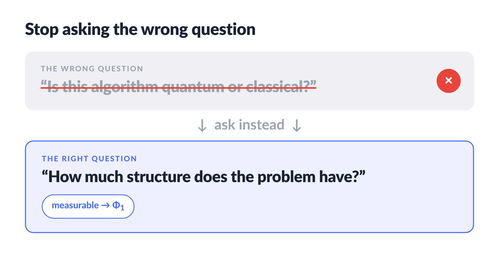
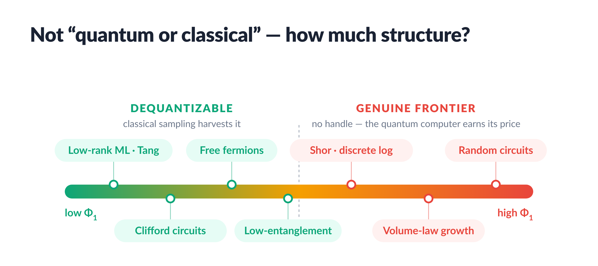
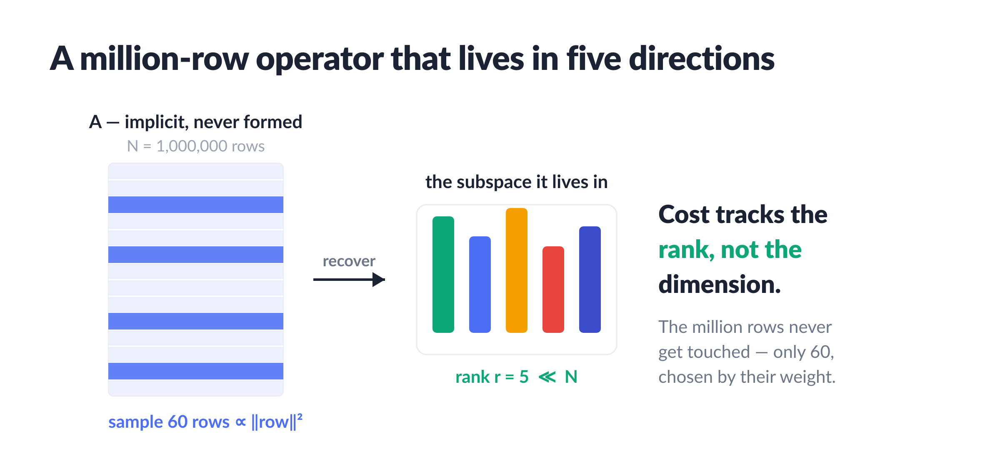
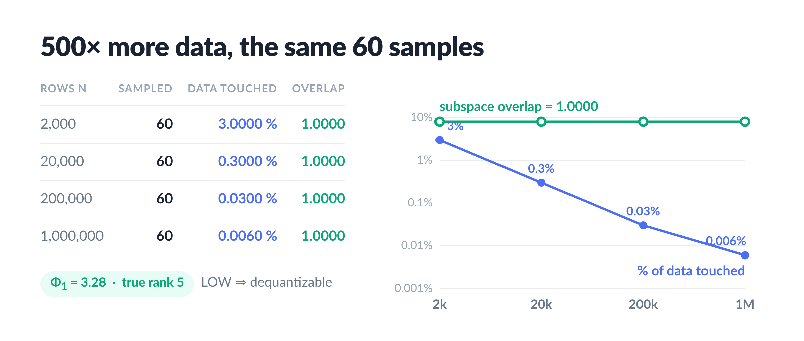
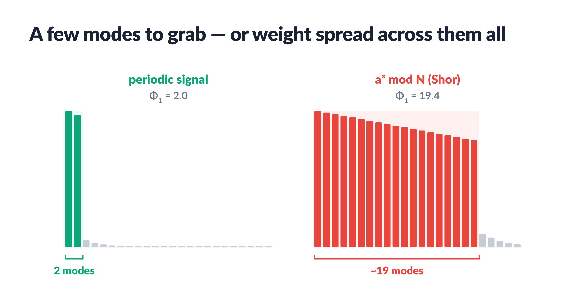
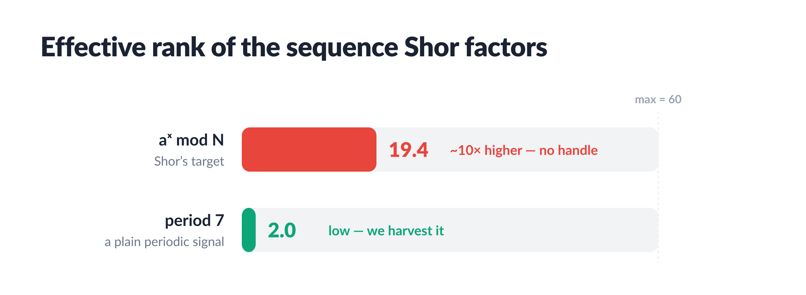
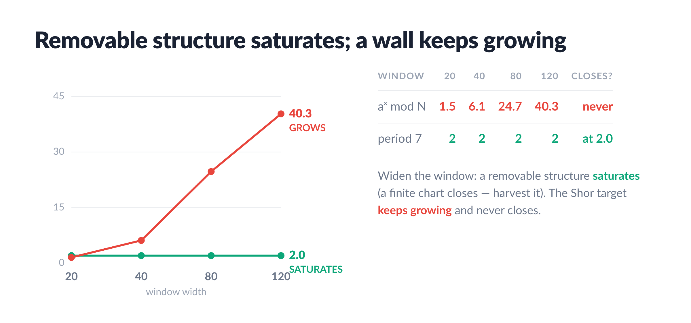

# Never Quantum at All


*A student dequantized a famous quantum algorithm. A single matrix-free dial tells you which speedups survive — and which were never quantum at all.*

## The speedup that wasn't

In 2018 a then-undergraduate, Ewin Tang, did something that was supposed to be impossible. There was a celebrated quantum algorithm for recommendation systems — the kind that suggests your next film — and it ran exponentially faster than any known classical method. It was a poster child for "quantum advantage in machine learning."

Tang dequantized it. She wrote a *classical* algorithm that matched the quantum one's speed. The exponential gap vanished. And it turned out not to be a one-off: a whole family of "quantum machine learning" speedups quietly collapsed the same way.

So the uncomfortable question is real. When someone shows you a quantum speedup, how do you know it is genuine — that no clever student will dequantize it next year — versus a speedup that was *redundant all along*, classical advantage wearing a quantum costume? There is a single number you can measure, matrix-free, that — in every case we have tested — separates the speedups with a known classical attack from those that resist one. Not a proof; a diagnostic that has been right wherever we have checked it.



## One number: effective rank

First, the one tool this piece leans on. **[resona](https://pypi.org/project/resona/)** is a small open-source library for *matrix-free* spectral computation: it answers questions about a giant operator — its spectrum, its rank, its structure — using nothing but matrix–vector products, never building or storing the matrix itself. That restriction is the whole point here, because the operators in question are far too big to write down. You hand resona a way to multiply by your operator; it hands back the numbers.

The number we want from it is **effective rank** — in resona, `Φ₁`. The shorthand: *quantum advantage needs structure a classical machine cannot cheaply simulate.* And the most common "structure" in quantum ML — low rank — is exactly the structure classical sampling harvests for free.

Here is the intuition. If a giant operator secretly lives in a low-dimensional subspace — its action is captured by a handful of directions — then you do not need to touch the whole thing. You can *sample* a few rows or columns and reconstruct that subspace. Cost scales with the rank, not the dimension. That is precisely what Tang's algorithm does, and it is why the quantum speedup evaporated: the quantum computer was paying (in entanglement, in qubits) for structure that classical sampling gets at a discount.

`Φ₁` measures that structure as a single scalar — the effective number of directions the operator really uses. Empirically the reading splits two ways: **low `Φ₁` tracks dequantizability** — a few directions carry the action, so sampling reconstructs it; **high `Φ₁` tracks the genuine frontier** — no low-rank handle for sampling to grab. This is a measured correlation across the cases below, not a theorem. A low reading flags a problem as a *candidate* for classical attack; a high reading says only that *this probe* found no extractable structure — not that none exists. One dial, computed from matrix–vector products, no matrix formed.

The reframing this buys you is worth pausing on. The usual question — "is this algorithm quantum or classical?" — turns out to be the wrong one. The right question is "how much *structure* does the problem have?", and structure is measurable.



> **A quantum computer pays a fixed price — qubits, coherence, error correction — to deal with problems whose structure cannot be harvested classically.**

If the structure is low, you overpaid: a classical sampler does the same job for free. The dial does not argue philosophy; it measures the resource and reads off which regime you are standing in.



## Where the advantage evaporates



The stand is [`stands/dequantize.py`](https://github.com/dimaq12/do-we-need-quantum-computing/blob/main/stands/dequantize.py). It builds an implicit low-rank operator (true rank `r = 5`, embedded in up to a million rows) and recovers its top singular subspace by sampling a fixed `s = 60` rows:



The same 60 samples work as `n` grows 500×. At a million rows we touch **0.006% of the data** and still recover the subspace with overlap **1.0000** — and the dial reads it correctly, `resona.effective_rank(AᵀA) = 3.28` against a true rank of 5. One fair-play note: "data touched" counts the sketched rows, and the ‖row‖² sampling distribution is assumed given — the *same* prepared-access assumption the quantum algorithm itself made (its QRAM; classically, Tang's data structure maintains those norms as the data is written).

Low `Φ₁`. The "exponential quantum advantage" here was redundant — it was paying for low-rank structure that classical sampling extracts for free.

## Shor: where the wall is real



Now point the *same dial* at Shor's algorithm — factoring, the speedup that actually threatens RSA. The stand is [`stands/shor_wall.py`](https://github.com/dimaq12/do-we-need-quantum-computing/blob/main/stands/shor_wall.py). When the order `r` is small, even classical period-finding factors `N` cheaply (`N=15` via order 4, `N=323` via order 72). The trouble is that for RSA-sized `N`, the order is itself exponentially large. So look at what `Φ₁` reads on the sequence `a^x mod N` — the thing Shor's quantum period-finding chews on:



The Shor sequence reads **`Φ₁ = 19.4`** — about **10× higher** than a simple periodic signal. No low-rank handle *that this probe can see*. And the dial's extractability test — does the structure *saturate* as you widen the window (removable) or keep *growing* (a genuine wall)? — is decisive:



The periodic signal saturates at 2.0 — a finite chart closes, you harvest it classically. The Shor target keeps growing (1.5 → 40.3) and never closes: the structure is **not extractable**, no finite window will ever contain it. That is the stand's own verdict — run it and it prints `extractable? False` for the Shor target, `True` for the periodic one. The same dial that dequantized the low-rank problem here points firmly the other way.

One sentence on what this means: the dial flagged "redundant — sample it" for the low-rank case and "no extractable structure here" for Shor — both *from the same matrix-free measurement*, the effective rank you already have. The first is a green light for a classical attack; the second is the *absence of a handle*, which is weaker than a proof that no handle exists — but it is exactly where every genuine quantum advantage we know of lives.

## The honest limit

One honest word on what Φ₁ is and isn't. It is not a proof that a speedup is impossible — or that one is necessary. It measures a single thing: how much low-dimensional structure a problem exposes to matrix-free probes. And the pattern is empirical — worth saying plainly. Every dequantization we tested lands in the low-Φ₁ regime; every textbook quantum advantage lands at the far end. That makes Φ₁ a *diagnostic* you can lean on — a number that has told the two apart every time we checked — not a theorem that says they always must. A clean track record, and the honesty to say "so far."

`Φ₁` does not beat *all* quantum computing — and the stand says so plainly. It beats exactly the **low-rank / structured class**: low-rank linear algebra (Tang), Clifford circuits, free fermions, low-entanglement dynamics. Speedups there are at most polynomial. It does **not** touch the genuine frontier: Shor factoring and discrete log, real-time volume-law entanglement growth, generic random-circuit sampling. Reading the dial as high does not give you a classical algorithm for Shor — beating Shor classically would mean factoring in polynomial time and breaking RSA, and there is no known path. The framework honestly points *away* from that. The dial tells you which fight you are in; it does not win the unwinnable one.

## So — do we need quantum computing?

Yes — for the problems that earn it. Shor-style period-finding, volume-law dynamics, generic random-circuit sampling: there the dial reads high, no classical handle exists, and the quantum computer's price buys something real. But for a surprising share of what has been sold as "quantum advantage" — everything living in the low-Φ₁ regime — the honest answer is the title of this piece. Measure first. If the effective rank is low, you never needed a quantum computer at all.

## Run it yourself

Everything — this article, both stands, and the figures — lives in one repository: **[github.com/dimaq12/do-we-need-quantum-computing](https://github.com/dimaq12/do-we-need-quantum-computing)**.

```
git clone https://github.com/dimaq12/do-we-need-quantum-computing.git
cd do-we-need-quantum-computing
pip install -r requirements.txt
python stands/dequantize.py
python stands/shor_wall.py
```

Every number above is reproducible: subspace overlap 1.0000 at a million rows touching 0.006% of the data, `Φ₁ = 3.28` on the low-rank side, `Φ₁ = 19.4` and the `extractable? False` verdict on the Shor side. Don't trust me — run it.
